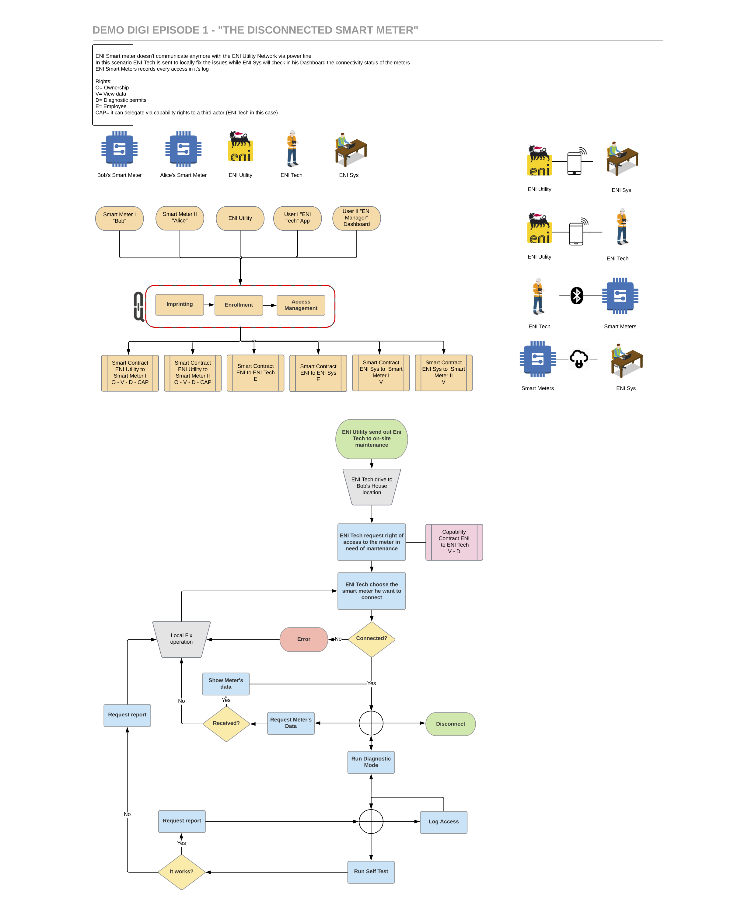

# Introduction

## The disconnected Smart Meter

In this scenario we are a company that provide smart meter for electricity consumption. One of our meter seems to have some connectivity problem so we need a technician on place to run diagnostic using his pad. The connectivity issue have a major consequence: company can't use a common UniquID contract because the meter can't access the blockchain. To solve this problem our tech will need a AirGap Policy, a special offline policy validated by the company.

This is the schema of the demo, for simplicity we will use only one meter and the communication between ENI Tech and Smart Meter will be over ethernet cable.

**ENI Sys**: the system administrator or manager. It can only read data coming from the meter and displayed on a dashboard.

**ENI Utility**: the service that provide the AirGap Policy. Is a java implementation of the UniquID node and run on local machine.

**ENI Tech**: the technician that run diagnostic on the meter. His pad is a C implementation of the UniquID node and run on a Raspberry Pi with a 7" display.  

**Smart Meter**: the meter. Is a C implementation of the UniquID node and run on a Raspberry PI with a Pimoroni Inky pHAT display.

