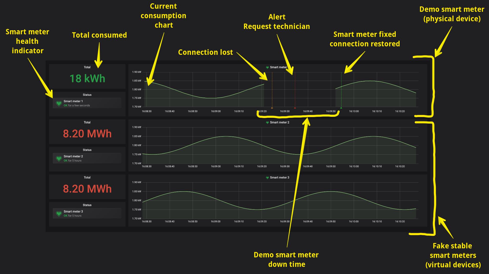

# Meter Dashboard

This is the dashboard where you can monitor the data coming from the meter and is a set of components deploying and managing by docker-compose.

### Requirements

* docker-compose

### Installation and Run

Clone the '[dev-demos](https://github.com/uniquid/internal-dev-demos)' repository

```bash
git clone git@github.com:uniquid/internal-dev-demos.git
```

Go to `dashboard` directory and run dashboard with `docker-compose`. Pay attention, that you need to use `--build` key to force rebuild emulator docker image.

```bash
cd internal-dev-demos/dashboard
sudo docker-compose up -d --build
```

To show data to dashboard you need to properly configure your Meter. Please refer to the [Smart Meter section](https://app.gitbook.com/@uniquid/s/sales-demo/smart-meter) to do this.

To access to dashboard, in your browser go to URL with your IP address and port 3000

### How to Use

1. Turn on smart meter device and make it publish data into mqtt
2. Go to dashboard with your browser
3. You will see three charges related to three smart meters \(physical and 2 fakes\)

If you disable demo smart meter connection, in a few seconds you will see status in 'health indicator' section changing to `pending` \(means that the data from the smart meter stopped receiving\). In a few more seconds you will see status `alert` \(means that there are communication problem and smart meter have to be fixed\). When the connection will be restored, you can see status back to `ok`.



To restart dashboard, you have to stop and run again the container

```bash
sudo docker-compose stop
sudo docker-compose up -d --build
```

To clean everything, you have to stop and forcefully remove docker containers

```bash
sudo docker-compose stop
sudo docker-compose rm
```

